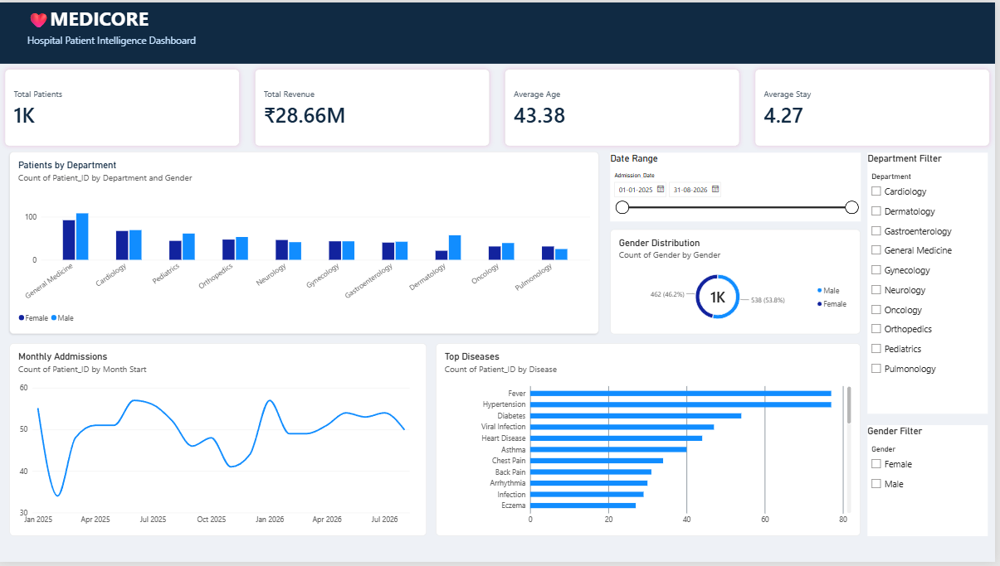

# 🏥 MEDICORE — Hospital Patient Intelligence Dashboard

> An interactive Hospital Patient Analytics Dashboard built using **Microsoft Power BI, DAX, Power Query, and Excel** to transform hospital patient data into meaningful business insights.

---

## 📊 Dashboard Preview


---

## 📌 Project Overview

**MEDICORE – Hospital Patient Intelligence Dashboard** is a data analytics and business intelligence project developed using Microsoft Power BI.

The project transforms a raw hospital patient dataset stored in Excel into an interactive dashboard containing **KPIs, charts, DAX calculations, date analysis, and interactive filters**.

The dashboard provides a centralized view of:

- Patient volume
- Hospital revenue
- Average patient age
- Average hospital stay
- Department-wise patient distribution
- Disease-wise patient distribution
- Monthly admission trends
- Gender distribution
- Date-based analysis

---

# 🎯 Project Objective

The main objective of this project is to demonstrate how raw healthcare data can be transformed into an interactive Business Intelligence dashboard.

The project focuses on:

- Cleaning and transforming raw data
- Creating meaningful KPIs
- Performing data analysis using DAX
- Creating interactive Power BI visualizations
- Analyzing patient admission trends
- Comparing departments and diseases
- Providing interactive filtering capabilities
- Presenting data in a professional dashboard format

---

# 📊 Dashboard Results

The dashboard provides the following key performance indicators based on the dataset:

| KPI | Result |
|---|---:|
| 👥 Total Patients | **1K** |
| 💰 Total Revenue | **₹28.66M** |
| 🎂 Average Age | **43.38 Years** |
| 🛏️ Average Stay | **4.27 Days** |

### Key Analytical Views

| Analysis | Visualization |
|---|---|
| 🏥 Patients by Department | Clustered Column Chart |
| 🦠 Top Diseases | Horizontal Bar Chart |
| 📅 Monthly Admissions | Line Chart |
| ⚧️ Gender Distribution | Donut Chart |
| 🔎 Department Analysis | Interactive Slicer |
| 👥 Gender Analysis | Interactive Slicer |
| 📆 Admission Period | Date Range Slicer |

---

# 🚀 Key Features

## 1. 📌 KPI Cards

A KPI is a measurable value used to track and understand the performance of a business, system, or process.

Four major KPIs are displayed at the top of the dashboard:

### Total Patients

Displays the total number of unique patients.

**Result:** `1K`

### Total Revenue

Displays the total billing amount generated from the patient records.

**Result:** `₹28.66M`

### Average Age

Displays the average age of patients.

**Result:** `43.38 Years`

### Average Stay

Displays the average number of days patients stayed in the hospital.

**Result:** `4.27 Days`

---

## 2. 🏥 Patients by Department

A clustered column chart is used to compare patient counts across different hospital departments.

### Departments Included

- Cardiology
- Dermatology
- Gastroenterology
- General Medicine
- Gynecology
- Neurology
- Oncology
- Orthopedics
- Pediatrics
- Pulmonology

This visualization helps identify differences in patient volume between departments.

---

## 3. 🦠 Top Diseases

A horizontal bar chart is used to analyze disease distribution.

It allows users to identify diseases with relatively higher patient counts within the dataset.

This type of visualization makes category comparison easier by displaying diseases along with their corresponding patient counts.

---

## 4. 📅 Monthly Admissions

A line chart is used to analyze patient admissions over time.

The monthly trend helps identify:

- Admission patterns
- Higher admission periods
- Lower admission periods
- Changes in patient volume
- Overall admission trends

---

## 5. ⚧️ Gender Distribution

A donut chart represents the distribution of patients by gender.

This provides a quick visual overview of the gender composition of the patient dataset.

---

## 6. 🔎 Interactive Department Filter

A Department slicer allows users to select one or multiple departments.

When a department is selected, the connected dashboard visuals update according to the selected filter.

---

## 7. 👥 Gender Filter

A Gender slicer allows users to filter the dashboard based on gender.

Available categories include:

- Female
- Male

---

## 8. 📆 Admission Date Filter

A date range slicer allows users to analyze patients within a selected admission period.

Users can select:

- Start date
- End date

This enables time-based exploration of the hospital dataset.

---

## 🧮 DAX Measures

DAX (Data Analysis Expressions) is a formula language used in Power BI to create measures, calculated columns, and perform data analysis.

The following DAX measures were created to calculate the key hospital KPIs:

```DAX
-- 1. Total Patients
Total Patients =
DISTINCTCOUNT(Patients[Patient_ID])


-- 2. Total Revenue
Total Revenue =
SUM(Patients[Billing_Amount_INR])


-- 3. Average Age
Average Age =
AVERAGE(Patients[Age])


-- 4. Average Stay
Average Stay =
AVERAGE(Patients[Length_of_Stay_Days])

## 📅 Date Analysis

The following calculated columns were created using DAX for monthly admission analysis and chronological sorting:

```DAX
-- Admission Month
Admission Month =
FORMAT(
    Patients[Admission_Date],
    "MMM YYYY"
)


-- Month Start
Month Start =
DATE(
    YEAR(Patients[Admission_Date]),
    MONTH(Patients[Admission_Date]),
    1
)
